# Signal Bot → ATAK Integration

Send a Signal message to yourself. A colored marker appears on your ATAK tactical map.

```
"48.567 39.878 tank"  →  📍 red marker on ATAK at those coordinates
```

---

## Quick Start

### Prerequisites
- Docker + Docker Compose
- A Signal account with a phone number

### Start Everything

No need to clone the repository. Copy the `docker-compose.yaml` file (or just its contents) to any directory on your machine, then:

```bash
docker compose pull
docker compose up -d
```

All images are pulled from Docker Hub automatically.

### Link Your Signal Number (first time only)

1. Open **http://localhost:5001** — the Signal Bot UI
2. Click **Link account**
3. In Signal app: **Settings → Linked Devices → Link New Device**
4. Scan the QR code shown (auto-refreshes every 25 s; tap "Refresh now" if needed)
5. Wait 5–10 seconds — Signal needs time to complete the key exchange with its servers
6. The page redirects automatically once linking succeeds

### Send a Test Message

Open Signal → **Note to Self** conversation, send:
```
48.567123 39.878970 tank
```

The bot replies with a confirmation. A red marker appears on your ATAK tactical map.

---

## Service URLs

| Service | URL | Purpose |
|---|---|---|
| Signal Bot UI | http://localhost:5001 | Link your Signal number, view docs |
| FreeTakServer UI | http://localhost:5000 | Manage the TAK server, webmap |
| Webmap | http://localhost:5000/webmap | Live CoT marker map |
| FreeTakServer CoT | TCP :8087 | Receives CoT markers |

---

## FreeTakServer UI Login

1. Open **http://localhost:5000/login**
2. Login with username `admin` and password `password`
3. Navigate to **Webmap** to see connected clients and CoT markers

The FreeTakServer UI provides:
- Connected client list
- CoT event log
- User management
- Server configuration

---

## Webmap

The webmap at **http://localhost:5000/webmap** shows live CoT markers colour-coded by affiliation:

| Marker | Colour | Meaning |
|---|---|---|
| ● | 🔴 Red | Hostile — keywords: `tank`, `artillery`, `enemy`, `hostile`, `target` |
| ● | 🔵 Cyan | Friendly — keywords: `friendly`, `ally`, `blue`, `friend` |
| ● | 🟡 Yellow | Unknown — any other description |

The map auto-refreshes every 5 seconds. Browser notifications fire when new markers arrive.

**Clear all markers** — click the 🗑 **Clear all** button (top-right of the map) to delete all markers from the database.

---

## Marker Colors: What to Send

Format: `<latitude> <longitude> <description>`

| Send | Marker | Example |
|---|---|---|
| Description contains `tank`, `artillery`, `enemy`, `hostile`, or `target` | 🔴 Red (Hostile) | `48.567 39.878 tank` |
| Description contains `friendly`, `ally`, `blue`, or `friend` | 🔵 Cyan (Friendly) | `50.1 30.5 friendly patrol` |
| Any other description | 🟡 Yellow (Unknown) | `51.0 32.0 checkpoint` |

---

## How It Works

### Big Picture

```mermaid
flowchart LR
    phone["📱 Signal App\n(your phone)"]
    servers["☁️ Signal Servers\n(internet)"]
    cli["☕ signal-cli\nJava daemon"]
    sra["🐹 signal-cli-rest-api\nHTTP + WebSocket server"]
    bot["🐍 signal-bot-api\nPython"]
    fts["🗺️ FreeTakServer"]
    atak["📡 ATAK Client"]

    phone -->|"encrypted message"| servers
    servers -->|"push via WebSocket"| cli
    cli -->|"JSON-RPC"| sra
    sra -->|"WebSocket"| bot
    bot -->|"CoT XML over TCP :8087"| fts
    fts --> atak
```



### Message Flow Step by Step

```
1. You type "48.567 39.878 tank" in Signal and send it to yourself
         │
         │  Signal encrypts and uploads to Signal's servers
         ▼
2. Signal's servers push the message to signal-cli (always-connected daemon)
         │
         │  signal-cli decrypts → passes to signal-cli-rest-api via JSON-RPC
         ▼
3. signal-cli-rest-api pushes a JSON envelope to the bot via WebSocket:
         {
           "envelope": {
             "syncMessage": {           ← self-message sync
               "sentMessage": {
                 "message": "48.567 39.878 tank"
               }
             }
           }
         }
         │
         ▼
4. signal-bot-api parses the message:
         lat=48.567   lon=39.878   description="tank"
         "tank" is in hostile keywords → type = a-h-G-U-C (Red)
         │
         │  builds CoT XML
         ▼
5. Sends raw XML over TCP to FreeTakServer:8087:
         <event type="a-h-G-U-C" ...>
           <point lat="48.567" lon="39.878" .../>
           <detail><contact callsign="tank"/>...</detail>
         </event>
         │
         ▼
6. FreeTakServer stores the event and broadcasts to all connected ATAK clients
         → Red "tank" marker appears on your ATAK tactical map

7. Bot replies to your Signal: "Sent to ATAK: tank  lat=48.567  lon=39.878  type=a-h-G-U-C"
```

---

## Architecture: Linking vs Registering

The bot is linked as a **secondary device** on your existing Signal account — exactly like Signal Desktop. No new phone number needed.

```
Your Signal account (+380xxxxxxxxx)
├── 📱 Primary device  (your phone)
└── 💻 Linked device   (signal-cli — this bot)
```

When you send a message to yourself (Note to Self), Signal encrypts it for **all** your devices and syncs it to each. The bot receives it as a `syncMessage.sentMessage` envelope.

---

## What is CoT?

CoT (Cursor on Target) is an XML standard used by military and emergency services for sharing position and target data:

```xml
<event version="2.0" uid="abc-123" type="a-h-G-U-C"
       time="2026-03-19T08:00:00Z" start="2026-03-19T08:00:00Z"
       stale="2026-03-19T09:00:00Z" how="m-g">
  <point lat="48.567" lon="39.878" hae="0" ce="9999999" le="9999999"/>
  <detail>
    <contact callsign="tank"/>
    <__group name="Red" role="Team Member"/>
  </detail>
</event>
```

Key fields:
- **type** — NATO symbol code. `a-h-G-U-C` = atoms/hostile/Ground/Unit/Combat
- **stale** — when ATAK removes the marker (1 hour from creation)
- **how** — `m-g` = machine-generated via GPS
- **hae** — height above ellipsoid (9999999 = unknown)

---

## Code Structure

```
signal-bot/
├── docker-compose.yaml          # full stack definition
├── README.md                    # this file
│
├── signal-bot-api/              # The bot (Python)
│   ├── main.py                  # WebSocket loop, CoT dispatch, events HTTP server (:8088)
│   ├── signal_client.py         # send_message(), get_accounts() via HTTP REST
│   ├── message_parser.py        # parse "lat lon description" → ParsedTarget
│   ├── cot_builder.py           # build CoT XML string
│   ├── fts_sender.py            # send XML over TCP to FreeTakServer:8087
│   └── Dockerfile
│
└── signal-bot-ui/               # Registration + status UI (Flask :5001)
    ├── app.py                   # routes: /, /link, /qrcode.png, /docs, /api/*
    ├── README.md                # copy of this file, served at /docs
    └── templates/
        ├── base.html            # shared layout + nav
        ├── index.html           # accounts list, color legend, notifications
        ├── link.html            # QR code for device linking (auto-refresh 25 s)
        └── docs.html            # rendered README (marked.js)
```

---

## Docker Images

All images are published to Docker Hub under `romancello/`:

| Image | Contents |
|---|---|
| `romancello/signal-bot-api` | Python 3.11-slim + websocket-client + requests |
| `romancello/signal-bot-ui` | Python 3.11-slim + Flask |
| `romancello/freetakserver` | Python 3.11-slim + FreeTAKServer (patched) |
| `romancello/freetakserver-ui` | Python 3.11-slim + FreeTAKServer UI (patched) |
| `romancello/fts-data-seed` | One-shot data seeder for `/opt/fts` |

Images use **multi-stage builds** — Poetry resolves deps in the build stage only; the final image ships only installed packages.

---

## FreeTakServer Docker Patches

The official FTS Docker quick-start required several fixes to work end-to-end:

- **UI DB write failure** — SQLite volume owned by root, container runs as non-root. Fix: UID/GID alignment + one-shot volume ownership init (`fts-ui-db-init`).
- **Browser unreachable API** — UI templates used internal container addresses. Fix: public API settings exposed via environment variables.
- **Socket.IO protocol mismatch** — v3 client vs v4 server caused handshake failures. Fix: aligned to v4 stack.
- **DigitalPy API drift** — class paths and startup hooks changed across versions. Fix: compatibility shims + fallback startup sequence.
- **Missing manifests** — components without `manifest.ini` crashed startup. Fix: skip and log instead of abort.
- **Empty volume on first run** — server booted without expected config files. Fix: `fts-data-seed` one-shot container pre-loads `/opt/fts`.
- **External webmap dependency** — failed when the tile service was absent. Fix: local Leaflet map backed directly by the FTS SQLite DB.
